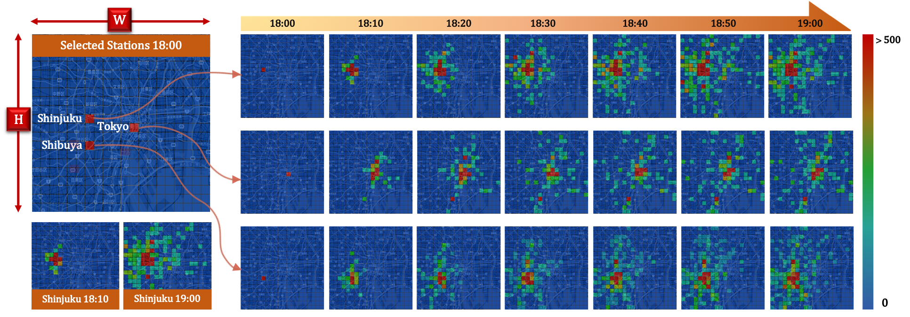
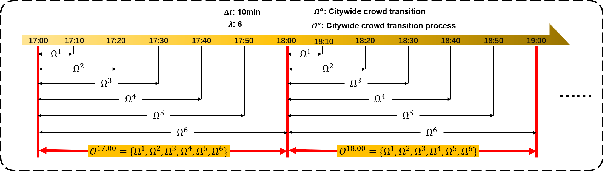

# Predicting Citywide Crowd Transition Process: <br>A Novel Challenge and A Deep Model
Submission to AAAI21: Predicting Citywide Crowd Transition Process: A Novel Challenge and A Deep Model
## Introduction 
Modeling citywide human mobility dynamically and continuously can be very significant to many smart city-related fields like transportation operation and crowd management. Governments and public service operators want to know how a crowd of people at a specific region and time stepwise transit to other regions in the short-term future. In this study, we propose a novel challenge to our urban computing community, which is to predict citywide crowd transition process constituted by a list of transition matrices from low order to high order, which can help us understand the details of crowd movements comparing to one-time crowd transition prediction.

<p align="center"></p> 
<p align="center">Fig. 1. People at Shinjuku/Tokyo/Shibuya Station on a weekday evening gradually flow to other regions of Tokyo within 1 hour.</p>

## Problem Formulation
Given observed <a href="https://www.codecogs.com/eqnedit.php?latex=\small&space;\alpha" target="_blank"></a>-steps of crowd transition process <a href="https://www.codecogs.com/eqnedit.php?latex=\mathcal{X}_{in}&space;=&space;\mathcal{O}_{t_1},&space;...,&space;\mathcal{O}_{t_{\alpha-1}},&space;\mathcal{O}_{t_\alpha}" target="_blank"></a> and metadata <a href="https://www.codecogs.com/eqnedit.php?latex=\small&space;M_{t_\alpha}" target="_blank"></a>, the prediction for the next step of citywide crowd transition process <a href="https://www.codecogs.com/eqnedit.php?latex=\hat{\mathcal{O}}_{t_{\alpha&plus;1}}" target="_blank"></a> is modeled as follows:

<p align="center"><a href="https://www.codecogs.com/eqnedit.php?latex=\small&space;\hat{\mathcal{O}}_{t_{\alpha&plus;1}}&space;=\mathop{\arg\!max}_{\mathcal{O}_{t_{\alpha&plus;1}}}{P(\mathcal{O}_{t_{\alpha&plus;1}}&space;\mid&space;\mathcal{O}_{t_1},&space;...,&space;\mathcal{O}_{t_{\alpha-1}},&space;\mathcal{O}_{t_\alpha},&space;M_{t_\alpha})}\forall&space;i&space;\in&space;\left(1,&space;\alpha\right],&space;\&space;t_{i}&space;-&space;t_{i-1}&space;=&space;\lambda&space;\Delta{t}." target="_blank"></a></p>

<p align="center"></p> 
<p align="center">Fig. 2. Citywide  crowd  transition and Citywide crowd transition process data.</p>

## Network Structure
Our DTP-Net architecturewhich consists of three parts: semantic graph convolution on local transition descriptor, parameter shared ConvLSTM feature extractor, and a multi-task module for multi-order learning. 

<p align="center"></p> 
<p align="center">Fig. 3. The Architecture of Deep Transition Process Network (DTP-Net).</p>

## Prerequisites
Our code is based on Python3.6. There are a few dependencies to run the code. The major libraries are listed as follows:
* Keras (>= 2.2.0)
* TensorFlow-gpu (>= 1.10.0)
* NumPy (>= 1.14.3)
* SciPy (>= 1.1.0)
* Scikit-learn (>= 0.19.1)

## Folder Structure
```
├── code
│   ├── DTP_Net.py
│   ├── Param.py
│   ├── load_data_DTM.py
│   ├── main.py
│   └── metric.py
├── data
│   ├── bousai_tokyo
│   │   ├── all_60min_6.npz
│   │   ├── day_info_1h.csv
│   │   ├── dis_adjacent.npy
│   │   └── hisflow_adjacent.npy
│   └── bousai_osaka
│       ├── all_60min_6.npz
│       ├── day_info_1h.csv
│       ├── dis_adjacent.npy
│       └── hisflow_adjacent.npy
├── figure
└── README.md
```

## Todo
Data will be published after the paper received.<br>
The data will be normalized and anonymized, and only the approximate maximum value will be published to protect user privacy.<br>
There will be a detailed description after the data is published.
